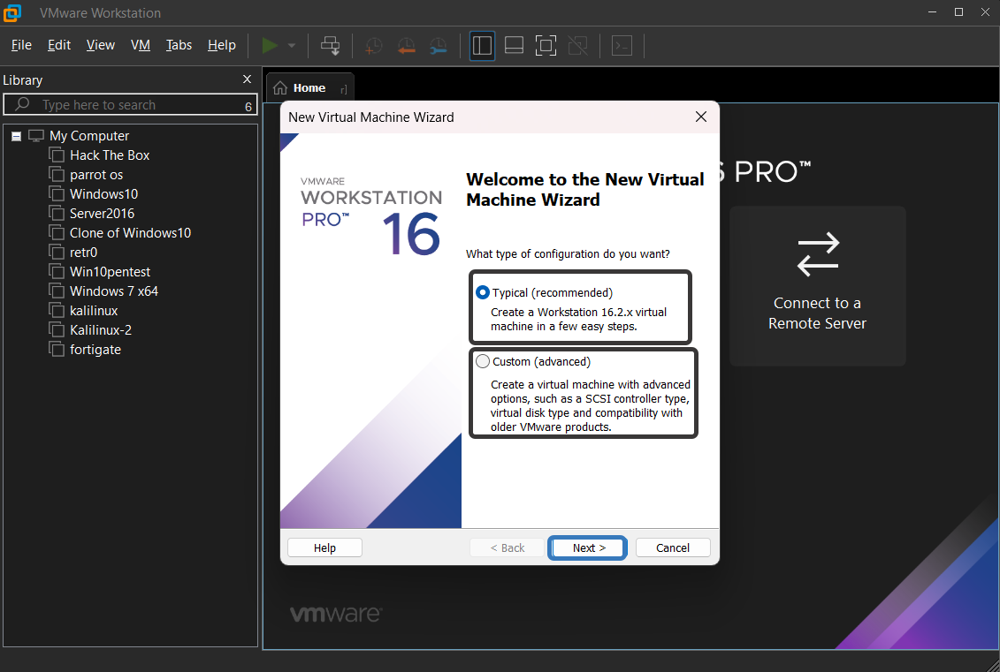
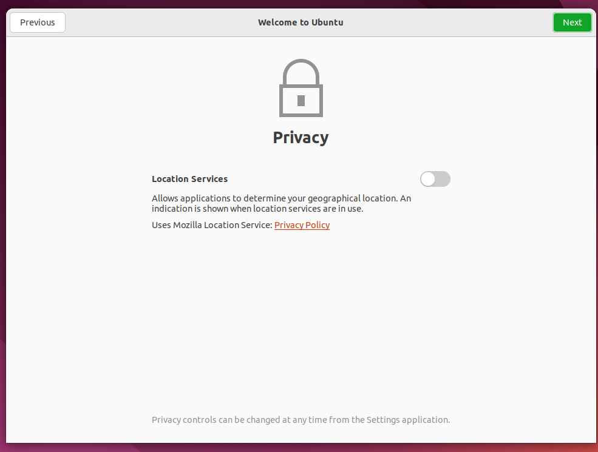

# Ubuntu Kurulumu 
Merhabalar, Öncelikle Ubuntu işletim sistemini isterseniz sanal makineye isterseniz direk sisteminize kurulumu gerçekleştirebilirsiniz.
İlk önce yapmamız gereken ubuntu iso dosyasını indirmek olacak indirmek için websitesine giriyoruz.
<a href="https://ubuntu.com/download/desktop">Web Sayfası</a>

İndir kısmını tıklıyoruz. LTE sürümünü seçme nedeni 5 yıl boyunca güvenlik ve bakım güncellemeleri ubuntu tarafından desteklenbiliyor olması. 2027'den sonra güncellemelere bağlı kalabilmek için yeniden format atarak yeni sürüme geçiş yapacağız.

Burada indir seçeğini tıkladıktan sonra indirilecek dosyayı görüyoruz eğer IDM gibi indirme programları kullanıyorsanız kabul edin. Yoksa zaten tarayıcınız otomatik olarak indirme sürecini başlatacaktır.

Gördüğünüz gibi iso Dosyamız indirdik eğer bu dosyayı sanal makine de değilde gerçek bir sisteme kurmak istiyorsanız <a href="https://rufus.ie/tr/">Rufus</a> adlı program ile yazdırmanız gerekir. Lakin Sanal Makine ile kurulum Yapacaksanız Yaptığım şekilde ilerleyebilirsiniz. <a href="https://www.vmware.com/products/workstation-player/workstation-player-evaluation.html">Vmware Workstation</a> aracını kullanacağım sanallaştırma için eğer sanallaştırma programınız çalışmıyorsa işlemciniz destekliyor mu yada bios tan açık mı diye kontrol etmeyi unutmayın

Gördüğünüz gibi solda daha önce oluşturduğum sanal işletim sistemlerim mevcut. Bizi ilk açılışta hoşgeldin ekranı karşılar. Lakin kapattınız ise hiç problem değil Ctrl + N kombinasyonu yada üstten file menüsünden New Virtural Machine seçeneğini seçerekte istediğimiz kurulum sihirbazı bizi karşılamış olacaktır. 

Gördüğünüz gibi bizi sanal makine kurulum sihirbazı karşıladı peki burada bize ne demek istiyor isterseniz bir bakalım. 

Typical Seçeneği : Direk önerilen ayarlar ile gelen seçenektir. Kullandığımız Vmware workstation sürümü ve uyumlulukları içerisinde kolayca kurulum yapmamızı sağlar.

Custom Seçeneği :  Eski Vmware sürümleri yani eski uygulama sürümleriyle uyumluluk, Sanal Disk Türü ayarlamaları gibi ayar çeşitliliği sunuyor bizlere.

Bizim şuan tek amacımız işletim sistemini tanımak olduğu için hazır ayarlarla ilerleyeceğiz.

burada 3 tane kurulum seçeneği görüyorsunuz 3 şekilde isoyu tanımlayabiliriz.

1.si Installer Disc :  hani rufus ile yazdırdığımız flash burada da çalışıyor mu mantığı ile yada sadece burada kurmak için en üstteki disk seçim bölümünü seçebiliriz yada deomon tools gibi araçlarla disk gibi gösterebilirsiniz isoyu

2.installer disk image file(iso) : burada indirdiğimiz isoyu direk seçebiliriz.

3.I will install the operating system later : burada sonradan iso seçme işlemi yapacağımızı işaretleyebiliriz.

Bizim burada yapmamız gereken 2.seçeneğe tıklayıp "Browse" Butonuna basarak. Dosya Gezgini ile iso dosyasını işaretlemek

Burada gördüğünüz gibi sadece iso görmeye tanımlı sağ alt da CD-ROM images (*.iso) yazısını gördüğünüz gibi sadece iso dosyalarını görebiliriz sadece indirdiğimiz kısma gelip isoyu seçmemiz gerekecek.

Gördüğünüz gibi otomatik olarak ubuntu-64 olarak algıladı kurulum sihirbazı. Bu yüzden bize hangi işletim sistemi indireceğimizi yada hangi dağıtımı indireceğimizi sormadan kuruluma devam edebileceğiz.
lakin başka bir sanallaştırıcı kullanıyorsanız. 

İşletim sistemi : Linux 

Dağıtım : ubuntu 64-bit

Bu kısımda kullanıcı adımızı ve poralamızı belirlememiz gerekir. Next diyerek bütün işlemleri bitirmiş ve kurulum sihirbazını da artık sonlandırabiliriz.

Kurulum Sihirbazını bitirdikten sonra otomatik olarak bizi bu şekilde karşılıyor kendi kendine açılıp 
açılmadı ise elle açabilmek için kurulan işletim sistemin üzerine iki defa sol tık ile tıklayın.

Dil ve Klavye ayarları yapıyoruz direk Turkish seçince dil ayarlarında otomatik olarak Türkçe Q klavye düzeni oluyor ama siz F klavye filan kullanıyorsanız değiştirebilirsiniz doğru mu değil mi diye deneyimlemek için hemen aşağıda bulunan "turk" olarak yazdığım kısım da deneyebilirsiniz.

Sürücüler ve ekstradan yazılımlar yükleyebilmek için : Install third-party software for graphics and Wi-Fi hardware and additional media formats 
Seçeneğini seçiyorum ve Continue butonuna basıyorum.

1.seçenek : Erase Disk and install ubuntu yani burada kurtaracağınız böleceğiniz ıvır zıvır yoksa ve tek disk belli ise direk kuruluma hepsini silip disktekini ubuntu işletim sistemine başlayacak

2.seçenek : ekstradan yapılması gereken bir ayar varsa misal disk bölümleri oluşturmak yeniden boyutlandırmak veya ubuntu için seçeceğiniz alan gibi o zaman bu seçeneği seçmeniz gerekir.

biz sanal makineden sadece buna disk verdiğimiz için direk Erase disk and install ubuntu seçeneğini seçeceğiz. "install now" Butonuna basıyoruz.

Burada Disklere olacak diğişiklilikleri bize gösteriyor bizde kabul etmek için continue deyip ilerliyoruz 

Gördüğünüz gibi yükleme devam ediyor 

Bize konum soruyor isterseniz istanbul yazan yere konumunuzu yada direk mause ile ülke üzerinden seçim yapabilirsiniz.

Burada bize kurulum sihirbazı ile sorduğu soru ile aynı Kullanıcı isminizi, makine - işletim sistemi ismi, Parolanızı giriyorsunuz.

Login automatically : Başlangıç Ekranında otomatik olması ve şifre sormaması için

Require my password to login : Başlagıç Ekranında şifreyi sorarak girebilmek için. 

Use Active Directory : Aktif dizin hizmetlerine bağlamak isterseniz bu seçeneği seçebilirsiniz. 

Bilgilerimizi topladı kuruluma devam ediyor.

Kurulum bittikten sonra yeniden başlatmamızı istiyor "Restart Now" seçeneğini işaretliyoruz. 

Oluşturduğumuz kullanıcı karşımıza geliyor sol tık ile seçiyoruz.

Password kısmına oluşturduğumuz parolayı giriyoruz.

Güncelleme işlemini daha sonra da yapılabilir aynı uygulamayı menüden açarak yada terminal den güncelle komutu vererek bu yüzden işlemi devam etmek için "Remind me later" seçeneğini seçiyoruz.

Varsa hesabınız girebilirsiniz şimdilik girmek istemiyorsanız sağ üst "skip" tuşuna basabilirsiniz.

ubuntu pro için token varsa devam edebilirsiniz yoksa "skip for now" seçeneğini seçip "next" butonuna basabilirsiniz.

Geliştiricilerin bilgi toplamasını istiyorsanız "Yes, system info to Cononical" 
istemiyorsanız "No, Don't send system info "

isterseniz lokasyon hizmetini aktif bırakabilir yada benim gibi kapatabilirsiniz. 

Burada mağazadan indirebileceğiniz uygulamaları görüyorsunuz. "Done" butonuna tıklayıp devam ediyoruz.

Kurulum bitti ve Ekran bizi burada karşıladı.
