# Ubuntu Güncelleme

Merhabalar, Sistemimiz üzerine güncellemeler almak için ubuntunun kendi sunduğu programlarını kullanacağız.

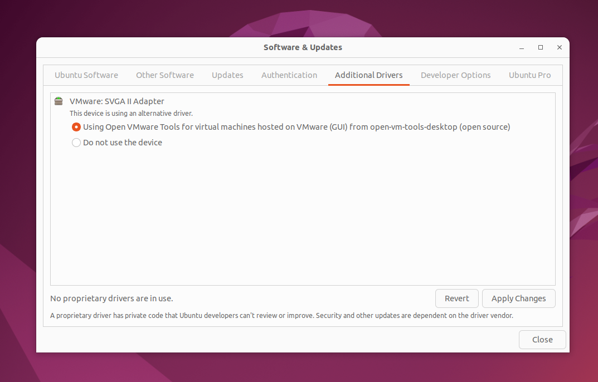

Software & update programını açınca biraz gezinirseniz güncelleme zamanlayıcısı vb.. ayarları olduğunu görebilirsiniz lakin biz kısa tutma ve sadece işlem üzerine gitmek için direk "Additiontal Drivers" menüsüne geldik.  
Güncellemeyı yapmak için "Apply Changes" kısmına tıklıyoruz

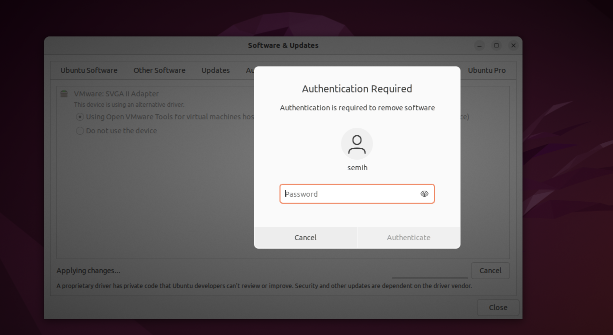

Kullanıcı Parolamızı giriyoruz.

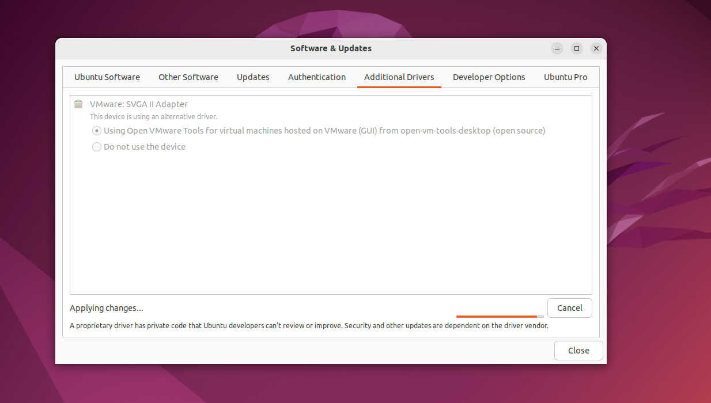

işlemin tamamlanmasını bekliyoruz.

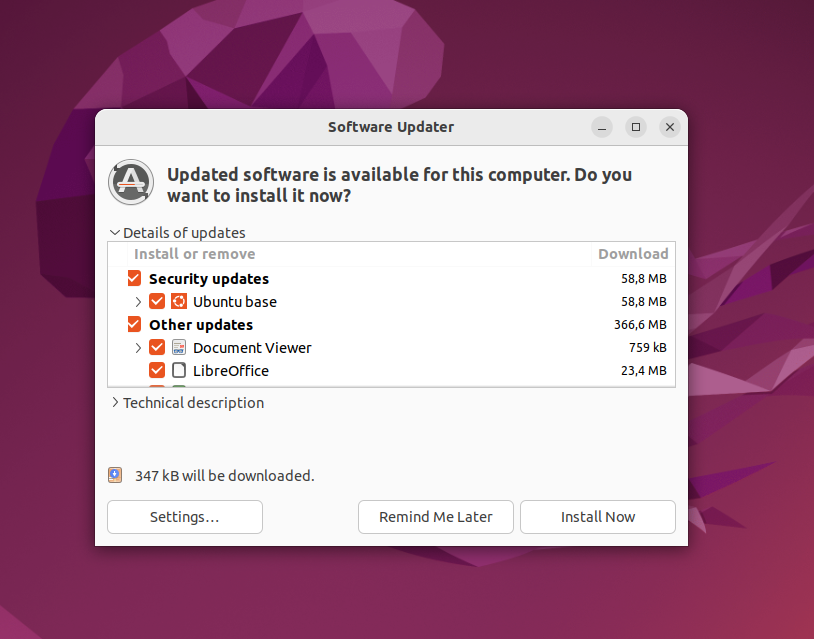

Diğer bir programımız ise "software updater" bu programı açarak güncellemelerin hepsini seçip "install Now" butonuna basarak onaylıyoruz.

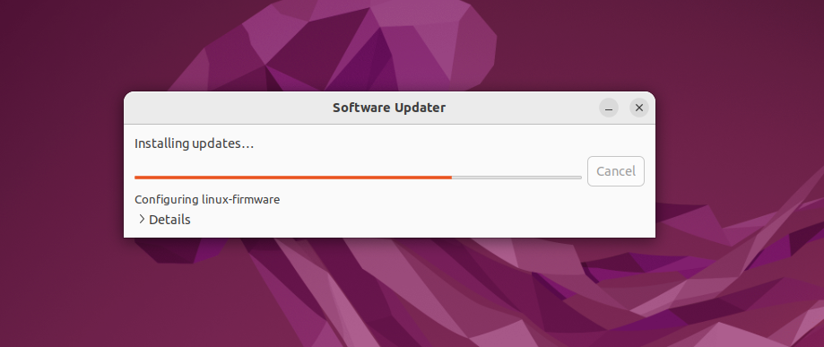

Kurulumları bekliyoruz.

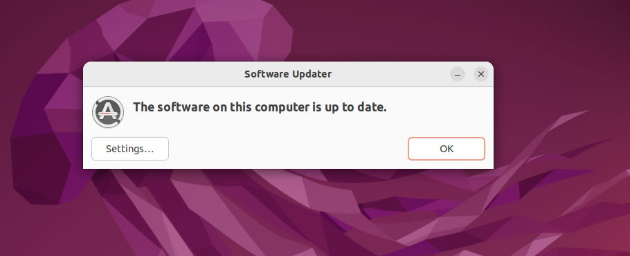

"Ok" butonuna basıp onaylayarak çıkıyoruz.

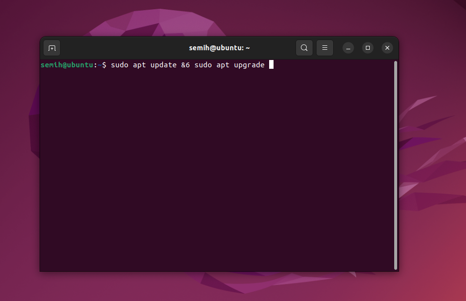

terminalden güncellemeyi kontrol etmek için sudo apt update && sudo apt upgrade yazıyoruz.

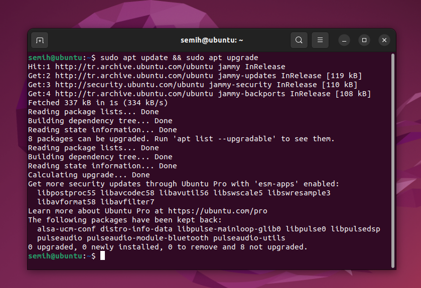

güncellemeleri bu şekilde teğet etmiş olduk.

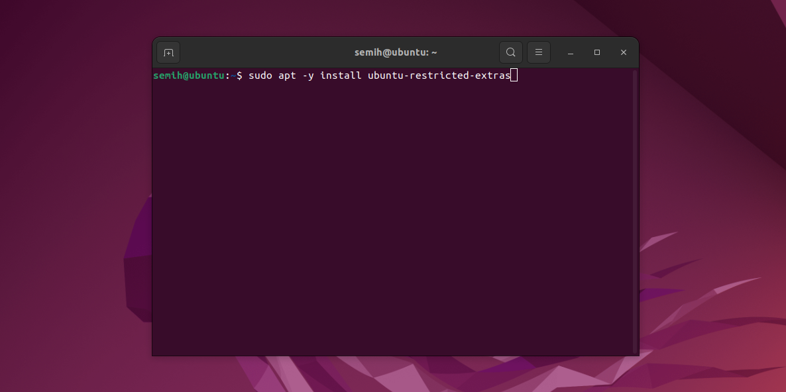

yasal sorunlar nedeniyle varsayılan olarak yüklenmeyen ek yazılımları bir araya getiren bir meta pakettir. 
ubuntu-restricted-extras meta paketi aşağıdaki temel paketleri sağlar:

- Yaygın olarak kullanılan video ve ses dosyaları için codec'ler  
- Microsoft TrueType çekirdek yazı tipleri  
- MP3 ve şifrelenmemiş DVD oynatma desteği  
- Adobe Flash eklentisi  

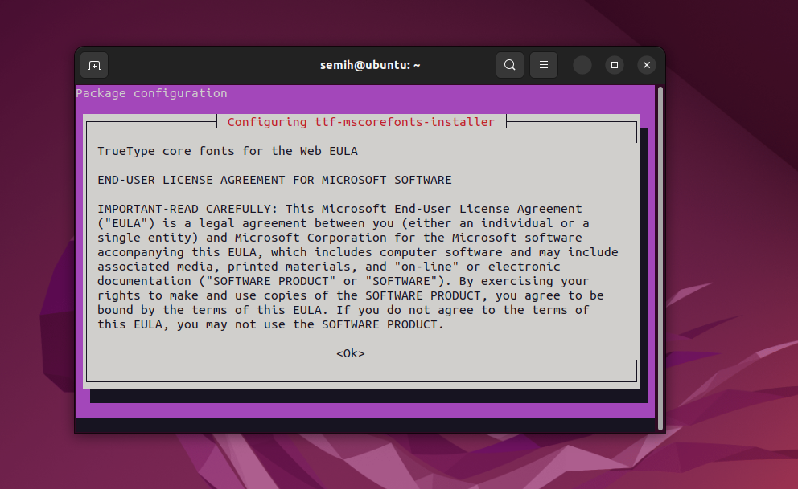

Tab tuşuna basarak "ok" Komutuna gelip enter tuşuna basarak onaylıyoruz.

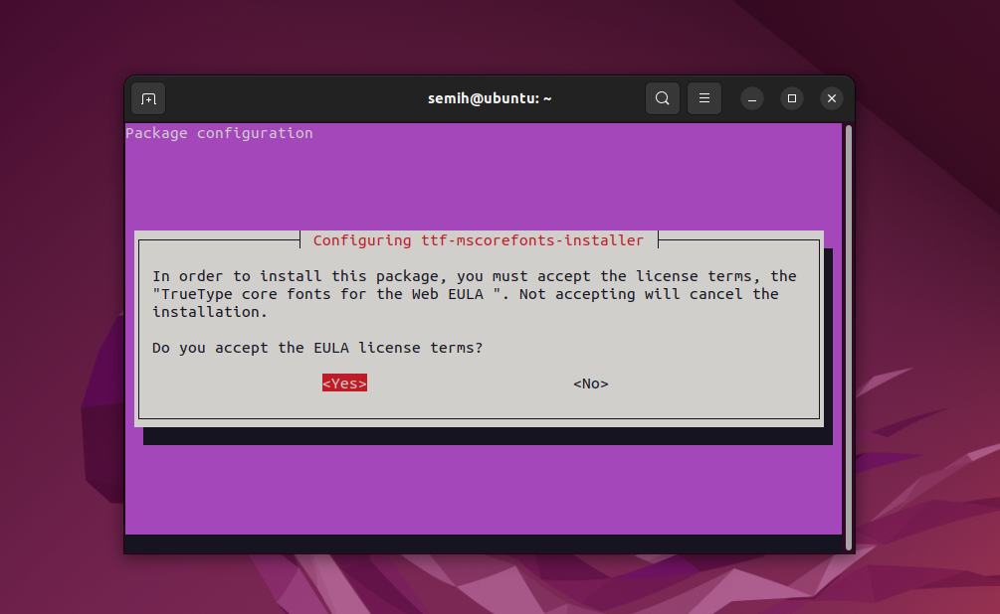

Tab tuşuna basarak "Yes" Komutuna gelip enter tuşuna basarak oynaylıyoruz.

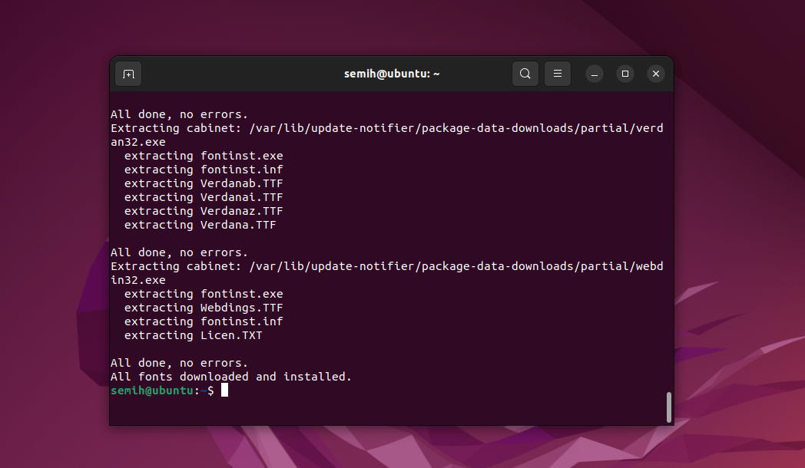

İşlemi Başarıyla Gerçekleştirdik.
